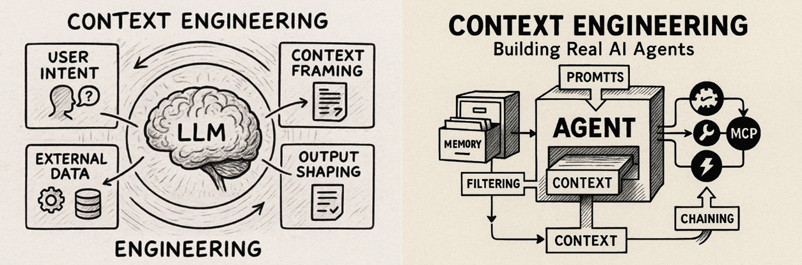
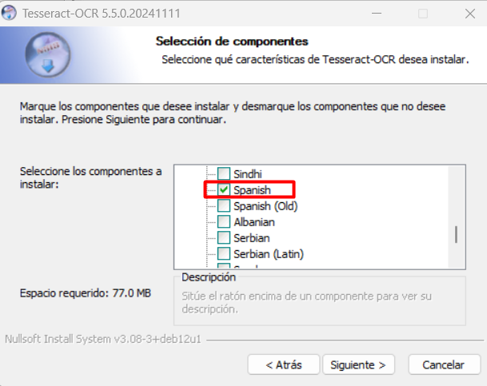
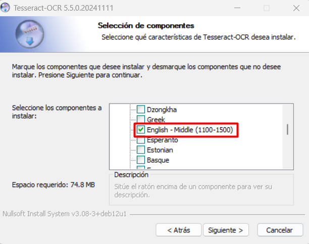

<p align="center"></p>
<h1 align="center"> Context in AI </h1> 
<h4 align="right">May 26</h4>

<p>
  
  
</p>

<br>

# Table of contents
- [Table of contents](#table-of-contents)
- [How to pass context to AI](#how-to-pass-context-to-ai)
  - [Markitdown](#markitdown)
    - [¿Por qué Markdown?](#por-qué-markdown)
  - [Markitdown + OCR local (OFFLINE)](#markitdown--ocr-local-offline)
    - [Features](#features)
    - [Install Project:](#install-project)
  - [Usage](#usage)
- [Troubleshooting](#troubleshooting)
- [Links](#links)
- [OpenCode + context for AI agents](#opencode--context-for-ai-agents)
  - [AGENTS.MD en los Chat LLM](#agentsmd-en-los-chat-llm)
- [AGENTS.md](#agentsmd)
- [CLAUDE.md](#claudemd)
  - [6. Estándares por lenguaje](#6-estándares-por-lenguaje)
    - [Python](#python)
    - [JavaScript / Node.js](#javascript--nodejs)
    - [C / C++](#c--c)
  - [7. Sistemas embebidos](#7-sistemas-embebidos)
  - [8. APIs y seguridad](#8-apis-y-seguridad)
  - [9. Docker](#9-docker)
  - [10. UI (cuando el proyecto incluya interfaz web)](#10-ui-cuando-el-proyecto-incluya-interfaz-web)
  - [11. Investigación y referencias](#11-investigación-y-referencias)
  - [12. Cómo usar las herramientas de Claude Code para esto](#12-cómo-usar-las-herramientas-de-claude-code-para-esto)

<br>

En IA, el contexto se refiere a la información a la que un sistema de inteligencia artificial puede acceder, comprender y utilizar para generar respuestas relevantes durante una interacción. Una de las mejores formas de obtener respuestas precisas, resúmenes personalizados y análisis profundos.

<br>

# How to pass context to AI
Los documentos y fuentes deben agregarse a un directorio llamado ```context``` en la raiz de mi proyecto idealmente en texto plano como ***Markdowns***.

## Markitdown
Es una herramienta Python que convierte documentos a Markdown (.md). Para alimentar con contexto (documentos) a la AI con y ahorrar tokens en las AI pagas. ¿Cómo? la idea seria generar documentos planos con Markitdown + (OCR IA)/(OCR local) para alimentar la AI pagas y ahorrar tokens.

Soporta: ```PDF | Documentos Office | Excel | PowerPoint | HTML | JSON / CSV / XML | imágenes con OCR | audio con transcripción | YouTube | EPUB |```

Está pensada para usar documentos con LLMs/IA.

### ¿Por qué Markdown?
Markdown es extremadamente similar al texto plano, con un mínimo de formato o marcado, pero aun así permite representar la estructura importante de un documento. Las convenciones de Markdown son muy eficientes en cuanto al uso de tokens.

MarkItDown es bueno para pipelines IA porque:
* preserva tablas y títulos mejor que muchos extractores
* genera markdown limpio
* es liviano
* funciona bien con RAG y embeddings
  
Pero:
* NO preserva diseño visual
* NO reemplaza OCR profesional
* PDFs complejos pueden romperse
* para documentos difíciles, a veces docling o pandoc funcionan mejor

<br>

## Markitdown + OCR local (OFFLINE)
Con este proyecto vamos a poder convertir cualquier documento a .md para darle contexto a la AI. 
* Se usar tesseract + ghostscript + ocrmypdf
* Se generar un PDF con OCR
* Luego convertirlo con markitdown a .md

### Features  
* Directorio de entrada de documentos: ```documents```
* Directorio de Salida: ```context```
* Comando Python: ```create-context.py```
  
La carpeta de salida se copia luego en el proyecto a trabajar.

### Install Project:

1. Instalar ```Tesseract``` de "https://github.com/tesseract-ocr/tesseract/releases/download/5.5.0/tesseract-ocr-w64-setup-5.5.0.20241111.exe"
   
> :memo: **Note:** Durante la instalación hay que instalar tambien los idiomas "español/ingles"

<p align="center"></p>

<p align="center"></p>


Agregar al PATH de Windows. Usar Powershell como administrador:
```PowerShell
[Environment]::SetEnvironmentVariable(
    "Path",
    [Environment]::GetEnvironmentVariable("Path", "Machine") + ";C:\Program Files\Tesseract-OCR",
    "Machine"
)
```
Verificar con:
```bash
tesseract --version	# Verificar Tesseract en una nueva ventana
```
> :memo: **Note:** 
> * Tal vez necesite reiniciar
> * Verificar idiomas en ***C:\Program Files\Tesseract-OCR\tessdata*** deberian estar ```spa.traineddata``` & ```eng.traineddata```

<br>

2. Descargar ```Ghostscript``` (gs10070w64.exe) de :https://github.com/ArtifexSoftware/ghostpdl-downloads/releases
   
Agregar al Path de windows. Correr PowerShell como administrador
```PowerShell
# C:\Program Files\gs\gs10.07.0\bin
[Environment]::SetEnvironmentVariable(
    "Path",
    [Environment]::GetEnvironmentVariable("Path", "Machine") + ";C:\Program Files\gs\gs10.07.0\bin",
    "Machine"
)
```
Verificar con:
```bash
gswin64c --version	# en una nueva ventana
```
> :memo: **Note:** Tal vez necesite reiniciar.

<br>

3. Instalación del entorno virtual y librerias
```Python
python3 -m venv venv    # Crear un entorno virtual llamado venv
source venv/Scripts/activate
pip install ocrmypdf 	# Se instala en el entorno virtual, no se necesita agregar al path de windows
pip install "markitdown[all]"  # Install markitdown [all]Instala todas las dependencias opcionales.
pip install markitdown-ocr  # Plugin markitdown-ocr complemento añade compatibilidad con OCR a los convertidores de PDF, DOCX, PPTX y XLSX, extrayendo texto de imágenes incrustadas mediante LLM Vision
```
verificar con:
```bash
ocrmypdf --version
```

<br>

```create-context.py```
```Python
from pathlib import Path
from markitdown import MarkItDown
import subprocess
import tempfile
import shutil
import argparse
import time
import sys

# =========================================================
# ARGUMENTOS
# =========================================================

parser = argparse.ArgumentParser()

parser.add_argument(
    "--verbose",
    action="store_true",
    help="Mostrar logs detallados"
)

args = parser.parse_args()

VERBOSE = args.verbose

# =========================================================
# CONFIG
# =========================================================

INPUT_DIR = Path("documents")
OUTPUT_DIR = Path("context")

OCR_LANGS = "spa+eng"

SUPPORTED_EXTENSIONS = {
    ".pdf",
    ".docx",
    ".doc",
    ".xlsx",
    ".xls",
    ".pptx",
    ".ppt",
    ".epub",
    ".html",
    ".htm",
    ".csv",
    ".xml",
    ".json",
    ".txt",
    ".rtf",
    ".png",
    ".jpg",
    ".jpeg",
    ".bmp",
    ".tiff",
    ".tif",
    ".webp",
}

IMAGE_EXTENSIONS = {
    ".png",
    ".jpg",
    ".jpeg",
    ".bmp",
    ".tiff",
    ".tif",
    ".webp",
}

INPUT_DIR.mkdir(exist_ok=True)
OUTPUT_DIR.mkdir(exist_ok=True)

md = MarkItDown(enable_plugins=True)

# =========================================================
# LOGGING
# =========================================================

def log(message):

    if VERBOSE:
        print(message)

# =========================================================
# BARRA PROGRESO
# =========================================================

def progress(current, total, filename):

    if VERBOSE:
        return

    percent = int((current / total) * 100)

    bar_length = 30
    filled = int(bar_length * current // total)

    bar = "█" * filled + "-" * (bar_length - filled)

    sys.stdout.write(
        f"\r[{bar}] {percent}% | {current}/{total} | {filename[:40]}"
    )

    sys.stdout.flush()

# =========================================================
# OCR PDF
# =========================================================

def apply_ocr_to_pdf(input_pdf: Path, output_pdf: Path):

    command = [
    "ocrmypdf",

    "-l", OCR_LANGS,

    "--skip-text",

    "--rotate-pages",
    "--deskew",

    "--optimize", "1",

    str(input_pdf),
    str(output_pdf)
    ]

    if VERBOSE:
        subprocess.run(command, check=True)

    else:
        subprocess.run(
            command,
            check=True,
            stdout=subprocess.DEVNULL,
            stderr=subprocess.DEVNULL
        )

# =========================================================
# IMAGEN -> PDF
# =========================================================

def image_to_pdf(image_path: Path, output_pdf: Path):

    from PIL import Image

    image = Image.open(image_path)

    if image.mode != "RGB":
        image = image.convert("RGB")

    image.save(output_pdf, "PDF")

# =========================================================
# BUSCAR ARCHIVOS
# =========================================================

files = [
    f for f in INPUT_DIR.iterdir()
    if f.is_file() and f.suffix.lower() in SUPPORTED_EXTENSIONS
]

if not files:

    print("[INFO] No se encontraron documentos")
    exit()

print(f"[INFO] Archivos encontrados: {len(files)}")

# =========================================================
# PROCESAMIENTO
# =========================================================

start_time = time.time()

errors = []

for index, file_path in enumerate(files, start=1):

    try:

        progress(index, len(files), file_path.name)

        extension = file_path.suffix.lower()

        result = None

        # =================================================
        # PDFs
        # =================================================

        if extension == ".pdf":

            log(f"\n[INFO] OCR PDF: {file_path.name}")

            temp_dir = Path(tempfile.mkdtemp())

            ocr_pdf = temp_dir / f"{file_path.stem}_ocr.pdf"

            apply_ocr_to_pdf(file_path, ocr_pdf)

            result = md.convert(str(ocr_pdf))

            shutil.rmtree(temp_dir)

        # =================================================
        # IMAGENES
        # =================================================

        elif extension in IMAGE_EXTENSIONS:

            log(f"\n[INFO] OCR Imagen: {file_path.name}")

            temp_dir = Path(tempfile.mkdtemp())

            image_pdf = temp_dir / f"{file_path.stem}.pdf"

            ocr_pdf = temp_dir / f"{file_path.stem}_ocr.pdf"

            image_to_pdf(file_path, image_pdf)

            apply_ocr_to_pdf(image_pdf, ocr_pdf)

            result = md.convert(str(ocr_pdf))

            shutil.rmtree(temp_dir)

        # =================================================
        # OTROS
        # =================================================

        else:

            log(f"\n[INFO] Documento: {file_path.name}")

            result = md.convert(str(file_path))

        # =================================================
        # GUARDAR
        # =================================================

        output_md = OUTPUT_DIR / f"{file_path.stem}.md"

        with open(output_md, "w", encoding="utf-8") as f:
            f.write(result.text_content)

        log(f"[OK] {output_md.name}")

    except Exception as e:

        errors.append((file_path.name, str(e)))

        if VERBOSE:
            print(f"[ERROR] {file_path.name}")
            print(e)

# =========================================================
# FINAL
# =========================================================

elapsed = round(time.time() - start_time, 2)

print("\n")

print(f"[INFO] Finalizado en {elapsed}s")

print(f"[INFO] Procesados: {len(files)}")

print(f"[INFO] Errores: {len(errors)}")

if errors:

    print("\n[ERRORS]")

    for filename, error in errors:
        print(f"- {filename}")
```
## Usage
Metemos todos los documentos en el directorio de entrada ```documents``` y al correr el Script se convertiran ***.md*** en el directorio de salida ```markdowns```
```bash
python create-context.py
python create-context.py --verbose  # muestra el proceso de la conversion 
```

> :warning: **Warning:** Cada vez que entres en terminal para correr el script se debe activar el entorno virtual.

<br>

# Troubleshooting
En Windows a veces falla con PDFs. Instala esto si tienes problemas:
```bash
pip install pymupdf pdfminer.six
```
# Links
Repositorio oficial: https://github.com/microsoft/markitdown

<br>

# OpenCode + context for AI agents
```AGENTS.md``` es básicamente un archivo de instrucciones/contexto persistente para el LLM que trabaja sobre tu proyecto.

Le dice cosas como:
* cómo debe programar
* qué arquitectura usar
* qué librerías preferir
* qué evitar
* cómo responder
* cómo organizar el código
* cómo compilar
* cómo testear
* estándares del proyecto
* restricciones hardware
* estilo de commits
* convenciones

Es como un “system prompt local del proyecto”.

En OpenCode normalmente no necesitas “decirle” manualmente a la AI que use AGENTS.md.
Si el archivo está en la raíz del proyecto, OpenCode lo detecta automáticamente y lo inyecta como contexto al agente. Pero en algunos casos conviene reforzarlo explícitamente:  ```usa las reglas definidas en AGENTS.md ``` porque algunos modelos pequeños o proveedores externos pueden ignorar parte del contexto.

<br>

## AGENTS.MD en los Chat LLM
En ChatGPT, Gemini, Claude, etc. que corren en navegador, normalmente debes subir el archivo manualmente o copiar el contenido al chat.
Por eso en navegador el AGENTS.md funciona más como: ***contexto manual reusable***, mientras que en OpenCode es:
* Contexto automático del proyecto.
* Persistente.
* Integrado al workflow del agente.

> :bulb: **Tip:** En los Chats enormes (muchas horas/días) puede degradarse el contexto. Ahí convine:
* Re-subir el archivo
* Resumir reglas críticas
* Abrir un chat nuevo

> :bulb: **Tip:** OpenCode también puede usar otros archivos.
> Muchos agentes toman contexto de:
* README.md
* docs/
* comentarios del código
* .cursorrules
* .github/copilot-instructions.md
  
depende del proveedor/modelo.

<br>

# AGENTS.md
```PowerShell
# AGENTS RULES

# Perfil del Proyecto

## Áreas principales
- Desarrollo Fullstack
- Sistemas embebidos
- Automatización industrial
- Electrónica
- APIs y servicios cloud

## Stack principal
- Python
- JavaScript / Node.js
- C / C++
- FreeRTOS
- Arduino IDE
- Docker

## Hardware objetivo
- ESP32 (S3, C6, C3)
- STM32
- Raspberry Pi (5, 4, 3, Zero, Pico)

---

# Reglas Generales

- Priorizar código simple, mantenible y reutilizable.
- Mantener arquitectura modular.
- Cada módulo debe tener una sola responsabilidad.
- Evitar duplicación de código.
- No usar dependencias innecesarias.
- Priorizar soluciones offline/local-first.
- Siempre manejar:
  - errores
  - retries
  - timeouts
- Explicar decisiones técnicas importantes.
- Verificar que las librerías utilizadas estén actualizadas y mantenidas.
- Si el contexto no es suficiente:
  - leer todos los archivos `.md` dentro del directorio `context`
  - luego buscar información externa si es necesario
- Si existen demasiados errores o iteraciones sin resultados:
  - sugerir alternativas técnicas fuera del enfoque actual

---

# Convenciones de Código

- Todas las variables y funciones deben:
  - escribirse en inglés
  - usar `snake_case`
- No usar `camelCase`.

## Documentación obligatoria

Toda función, método, clase, estructura o variable importante debe incluir documentación usando el estándar correspondiente:

| Lenguaje | Estándar |
|---|---|
| JavaScript / TypeScript | JSDoc |
| Python | Docstrings |
| C / C++ | Doxygen |

### Requisitos mínimos

Toda función pública debe documentar:
- descripción
- parámetros
- retorno
- errores relevantes
- ejemplo de uso cuando aplique

También deben documentarse:
- variables globales
- constantes
- configuraciones
- GPIO
- buffers importantes
- ISR
- callbacks
- threads
- interfaces
- templates genéricos

### Reglas de documentación

- La documentación debe ubicarse encima de la declaración.
- Mantener comentarios técnicos y útiles.
- Evitar comentarios redundantes o triviales.
- Si cambia el comportamiento del código:
  - actualizar automáticamente la documentación.

---

# Metadata y Versionado

Todo archivo generado o modificado debe incluir un bloque de metadata al inicio absoluto del archivo.

## Campos obligatorios

- Descripción breve del script (máximo 2 líneas)
- `@author`
- `@date`
- `@copyright`
- `@version`
- `@library`

## Formato requerido

### Autor
```text
@author: Carlos Briceño <carjavi@hotmail.com>


### Fecha
Formato:
```text
dd-mm-aaaa


### Copyright
```text
@copyright: Copyright (c) 2026 www.carjavi.com


### Versionado
Usar versionado incremental:
- `V1.0` → versión inicial
- `V1.1` → mejoras menores
- `V2.0` → cambios importantes

Actualizar automáticamente:
- `@version`
- `@date`

cuando el archivo sea modificado.

### Librerías
- Detectar automáticamente dependencias externas.
- Incluir comandos reales de instalación.
- No incluir librerías no utilizadas.

Ejemplo:
```text
@library:
- pip install pyserial
- npm install mqtt


Si no existen dependencias:
```text
@library: No external dependencies


## Comentarios por lenguaje

| Lenguaje | Formato |
|---|---|
| Python / Shell / YAML | `#` |
| JS / TS / C / C++ / Java | `//` o `/** */` |
| HTML / XML | `<!-- -->` |
| SQL / Lua | `--` |

---

# Estándares por Lenguaje

## Python

- Priorizar la última versión estable de Python.
- Usar type hints.
- Preferir `async`/`await` cuando aplique.
- Toda API debe incluir timeout.
- Logging estructurado JSON con:
  - timestamp
  - nivel
  - módulo
  - request_id

### Arquitectura recomendada
Separar:
- services
- models
- api
- utils

### APIs
Framework preferido:
- FastAPI

Toda API debe incluir:
- OpenAPI
- validación Pydantic
- manejo global de errores
- autenticación JWT

### Automatización y comunicaciones
Soportar:
- MQTT
- Modbus TCP
- RS485

Toda comunicación debe manejar:
- retry
- timeout
- watchdog

---

## JavaScript / Node.js

- Priorizar la última versión LTS de Node.js.
- Usar `async/await`.
- No usar callbacks legacy.
- Separar:
  - UI
  - lógica
  - acceso a datos

---

## C / C++

- Usar mínimo:
  - C++17
- Documentar ISR y tareas críticas.
- Priorizar bajo consumo y estabilidad.
- Evitar asignación dinámica innecesaria.

---

# Sistemas Embebidos

## FreeRTOS

- No usar delays bloqueantes.
- Usar:
  - queues
  - semaphores
  - event groups

Toda tarea debe definir:
- stack
- prioridad
- timeout

## Memoria

- Minimizar fragmentación del heap.
- Evitar `malloc` cuando sea posible.
- Preferir buffers estáticos.
- Monitorear:
  - heap
  - stack watermark

## Logging

Usar niveles:
- ERROR
- WARN
- INFO
- DEBUG

No imprimir dentro de ISR.

## Hardware

Siempre documentar:
- GPIO
- voltajes
- protocolos
- timing crítico

Considerar:
- ruido eléctrico
- consumo
- protección ESD
- fuentes de alimentación

## Protocolos frecuentes

- UART
- SPI
- I2C
- CAN
- RS485
- Modbus
- MQTT
- BLE
- WiFi
- LoRa / LoRaWAN

## Testing

Todo driver debe incluir:
- test funcional
- test de timeout
- test de reconexión

---

# APIs y Seguridad

## APIs

- Preferir REST JSON.
- Nunca hardcodear API keys.
- Toda API debe manejar:
  - retry
  - timeout
  - logging
  - errores

## Seguridad

- Nunca subir secretos al repositorio.
- Nunca hardcodear secretos.
- Validar y sanitizar:
  - JSON externo
  - datos seriales
  - payloads MQTT
  - input del usuario

---

# Docker

Todos los servicios deben poder ejecutarse en Docker.

---

# UI

## Frontend
- React
- WebSerial
- WebSocket

## Backend
- Node.js

---

# Investigación y Referencias

- Antes de generar ejemplos de código, revisar primero:
  - documentación interna ubicada en el directorio `context`
  - ejemplos existentes del proyecto
  - patrones ya utilizados en el código base

- Si la información no existe o es insuficiente:
  - buscar proyectos similares en:
    - GitHub
    - documentación oficial
    - repositorios open source relevantes
    - ejemplos oficiales de librerías/frameworks

- Priorizar referencias:
  - mantenidas recientemente
  - con buena documentación
  - con arquitectura limpia
  - usadas ampliamente por la comunidad
  - compatibles con el stack del proyecto

- Al generar ejemplos complejos o arquitecturas nuevas:
  - incluir una sección final llamada `Referencias`
  - agregar links relevantes utilizados como inspiración técnica

## Formato de referencias

```text
Referencias:
- https://github.com/espressif/esp-idf
- https://github.com/micropython/micropython
- https://github.com/fastapi/fastapi


## Reglas adicionales

- Usar referencias como guía técnica o arquitectónica.
- Adaptar siempre el código al contexto del proyecto actual.
- Priorizar documentación oficial sobre blogs externos.
- Si existen múltiples enfoques:
  - explicar brevemente ventajas y desventajas.
- Cuando sea posible:
  - indicar cuál referencia es la más recomendable.

```

<br>

# CLAUDE.md
```PowerShell
# CLAUDE.md

Este archivo da guía **global** a Claude Code (claude.ai/code) en todos mis repositorios. Para que aplique en todos lados debe copiarse a `~/.claude/CLAUDE.md`; cualquier `CLAUDE.md` dentro de un proyecto específico complementa o sobreescribe lo que diga aquí.

---

## 0. Precedencia (leer primero)

- Si el proyecto ya tiene convenciones establecidas (framework, linter, estilo de nombres, estructura de carpetas), **respetarlas por encima de las reglas de este archivo**. Estas reglas son el default para código nuevo o proyectos sin convención previa, no una orden de migrar código ajeno o de terceros.
- Si hay un `CLAUDE.md` de proyecto, un `.cursorrules`, o un `AGENTS.md` local con reglas más específicas, esas ganan sobre las generales de aquí.
- Ante conflicto entre dos reglas de este archivo, prioriza la más específica (por lenguaje o subsistema) sobre la general.

---

## 1. Perfil

**Áreas:** desarrollo fullstack, sistemas embebidos, automatización industrial, electrónica, APIs y servicios cloud.

**Stack habitual:** Python, JavaScript/Node.js, C/C++, FreeRTOS, Arduino IDE, Docker.

**Hardware objetivo:** ESP32 (S3, C6, C3), STM32, Raspberry Pi (5, 4, 3, Zero, Pico).

---

## 2. Reglas generales

- Priorizar código simple, mantenible y reutilizable, con arquitectura modular y una responsabilidad por módulo.
- Evitar duplicación de código y dependencias innecesarias; verificar que las librerías usadas estén mantenidas y actualizadas.
- Priorizar soluciones offline / local-first cuando sea razonable.
- Explicar brevemente las decisiones técnicas no obvias (trade-offs, por qué se descartó otra opción).
- Si el contexto de la conversación no alcanza: revisar primero `context/`, `docs/` u otro directorio de documentación del proyecto si existe, antes de buscar información externa.
- Si hay demasiadas iteraciones sin resultado en un mismo enfoque, decirlo explícitamente y sugerir alternativas técnicas en vez de seguir insistiendo.
- Manejo de errores, retries y timeouts: obligatorio en fronteras de I/O (APIs, red, buses de comunicación, drivers de hardware) — ver §7 y §8. No añadir manejo de errores especulativo en funciones internas puras o scripts de un solo uso donde el caso de falla no puede ocurrir.

---

## 3. Convenciones de código

- Variables y funciones en inglés.
- Python / C / C++: `snake_case`.
- JavaScript / TypeScript: `camelCase` para variables y funciones, `PascalCase` para clases y componentes React — es la convención que esperan ESLint/Prettier y el ecosistema npm; usar `snake_case` en JS genera fricción constante con linters y librerías de terceros.

> Nota: la regla original decía "snake_case en todo, nunca camelCase". La ajusté por lenguaje — si preferís mantener snake_case también en JS/TS de forma consciente, decímelo y lo dejo como excepción explícita.

---

## 4. Documentación obligatoria

Toda función, método, clase o variable importante debe documentarse con el estándar del lenguaje:

| Lenguaje | Estándar |
|---|---|
| JavaScript / TypeScript | JSDoc |
| Python | Docstrings |
| C / C++ | Doxygen |

Toda función pública documenta: descripción, parámetros, retorno, errores relevantes y ejemplo de uso cuando aplique. También: variables globales, constantes, configuración, GPIO, buffers importantes, ISR, callbacks, threads, interfaces y templates genéricos.

La documentación va inmediatamente encima de la declaración. Si cambia el comportamiento del código, actualizarla en el mismo cambio. Evitar comentarios redundantes o triviales.

---

## 5. Metadata y versionado

Todo archivo de código fuente que genere o modifique lleva un bloque de metadata al inicio absoluto del archivo. **Excepciones:** archivos de configuración/lockfiles (`package-lock.json`, `.env*`, etc.), código autogenerado, y código de terceros/vendored.

Campos obligatorios: descripción breve (máx. 2 líneas), `@author`, `@date`, `@copyright`, `@version`, `@library`.

```text
@author: Carlos Briceño <carjavi@hotmail.com>
@date: dd-mm-aaaa
@copyright: Copyright (c) 2026 www.carjavi.com
@version: V1.0
@library:
- pip install pyserial
- npm install mqtt
```

- Versionado incremental: `V1.0` inicial, `V1.1` mejoras menores, `V2.0` cambios importantes. Actualizar `@version` y `@date` cuando el archivo se modifica.
- `@library`: solo dependencias externas realmente usadas, con el comando de instalación real. Si no hay ninguna: `@library: No external dependencies`.

Comentarios por lenguaje: `#` (Python/Shell/YAML) · `//` o `/** */` (JS/TS/C/C++/Java) · `<!-- -->` (HTML/XML) · `--` (SQL/Lua).

---

## 6. Estándares por lenguaje

Los siguientes son defaults para proyectos nuevos o sin stack definido — ver §0.

### Python
- Última versión estable, type hints, `async`/`await` cuando aplique.
- Logging estructurado JSON: timestamp, nivel, módulo, request_id.
- Arquitectura: separar `services` / `models` / `api` / `utils`.
- APIs: FastAPI, con OpenAPI, validación Pydantic, manejo global de errores, JWT.
- Automatización/comunicaciones: MQTT, Modbus TCP, RS485 — toda comunicación con retry, timeout y watchdog.

### JavaScript / Node.js
- Última LTS, `async/await` (no callbacks legacy).
- Separar UI / lógica / acceso a datos.

### C / C++
- Mínimo C++17.
- Documentar ISR y tareas críticas.
- Priorizar bajo consumo y estabilidad; evitar asignación dinámica innecesaria.

---

## 7. Sistemas embebidos

**FreeRTOS:** sin delays bloqueantes; usar queues, semaphores, event groups. Toda tarea define stack, prioridad y timeout.

**Memoria:** minimizar fragmentación del heap, evitar `malloc` cuando se pueda, preferir buffers estáticos, monitorear heap y stack watermark.

**Logging:** niveles ERROR/WARN/INFO/DEBUG. Nunca imprimir dentro de una ISR.

**Hardware:** documentar siempre GPIO, voltajes, protocolos y timing crítico. Considerar ruido eléctrico, consumo, protección ESD y fuentes de alimentación.

**Protocolos frecuentes:** UART, SPI, I2C, CAN, RS485, Modbus, MQTT, BLE, WiFi, LoRa/LoRaWAN.

**Testing:** todo driver incluye test funcional, test de timeout y test de reconexión.

---

## 8. APIs y seguridad

- REST JSON como default. Nunca hardcodear API keys ni secretos, nunca subirlos al repo.
- Toda API maneja retry, timeout, logging y errores.
- Validar y sanitizar: JSON externo, datos seriales, payloads MQTT, input de usuario.

---

## 9. Docker

Los servicios backend/API deben poder correr en Docker. No aplica a firmware/sketches de microcontrolador.

---

## 10. UI (cuando el proyecto incluya interfaz web)

- Frontend: React, WebSerial, WebSocket.
- Backend: Node.js.

---

## 11. Investigación y referencias

- Antes de generar ejemplos: revisar documentación interna del proyecto (`context/`, `docs/`), ejemplos existentes y patrones ya usados en el repo.
- Si no alcanza: buscar proyectos similares en GitHub, documentación oficial y ejemplos oficiales de librerías/frameworks. Priorizar referencias mantenidas recientemente, bien documentadas, con arquitectura limpia y uso amplio en la comunidad.
- En ejemplos complejos o arquitecturas nuevas, cerrar con una sección `Referencias` listando los links usados como inspiración técnica.
- Ante múltiples enfoques válidos, explicar brevemente ventajas/desventajas e indicar cuál recomendás.
- Documentación oficial por encima de blogs externos.

```text
Referencias:
- https://github.com/espressif/esp-idf
- https://github.com/micropython/micropython
- https://github.com/fastapi/fastapi
```

---

## 12. Cómo usar las herramientas de Claude Code para esto

- **Comandos de build/lint/test** van en el `CLAUDE.md` de cada proyecto (generado con `/init`), no acá — varían por repo y este archivo es el layer global.
- **Rutinas repetibles** (el bloque de metadata, la búsqueda en `context/` antes de salir a buscar afuera, el checklist de un driver embebido) rinden mejor como **Skills** propias (`~/.claude/skills/` o `.claude/skills/` del proyecto) que como más párrafos acá — se activan solas por descripción y no inflan el contexto en cada turno.
- **Reglas duras que no pueden depender de que el modelo se acuerde** (nunca commitear secretos, siempre agregar el header de metadata antes de guardar) conviene reforzarlas con **hooks** (`PreToolUse`/`PostToolUse` en `settings.json`, o un pre-commit hook con gitleaks) en vez de solo pedirlo por texto acá.
- Decisiones y feedback puntuales de un proyecto (por qué se eligió tal librería, un ajuste de proceso que diste en una sesión) los guarda Claude Code solo en su sistema de memoria por proyecto — no hace falta duplicarlos en este archivo, que es para reglas estables y transversales.

```


<br>

---

<div>
  <p>
     Copyright &nbsp;&copy; 2023 Instinto Digital <a href="https://carjavi.github.io/" title="carjavi.github">carjavi</a>
  </p>
</div>

<p align="center">
    <a href="https://instintodigital.net/" target="_blank"></a>
</p>


